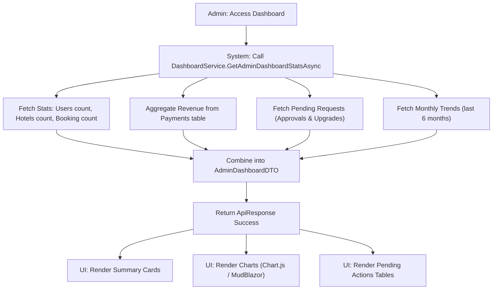

# Admin Dashboard - Design Document

## 1. Process Flow: Data Aggregation



---

## 2. Wireframe (UI/UX Draft)

### 2.1. Main Dashboard Layout
```text
+---------------------------------------------------------------------------------------+
|  [ ADMIN PORTAL ]                              [ Notification ] [ Admin Profile ]     |
+-----------------+---------------------------------------------------------------------+
| SIDEBAR         |  DASHBOARD OVERVIEW                                  [ REFRESH ]    |
|                 +---------------------------------------------------------------------+
| [D] Dashboard   |  +------------+  +------------+  +------------+  +------------+     |
| [U] Users       |  | REVENUE    |  | TOTAL USERS|  | HOTELS     |  | BOOKINGS   |     |
| [H] Hotels      |  | $120,500   |  | 1,240      |  | 450        |  | 3,890      |     |
| [R] Requests    |  +------------+  +------------+  +------------+  +------------+     |
|                 |                                                                     |
| [M] Master Data |  MONTHLY REVENUE TREND                 PENDING APPROVALS            |
|                 |  +---------------------------+       +---------------------------+  |
| [S] Settings    |  |          [ CHART ]        |       | - Hotel Daewoo (Pending)  |  |
|                 |  |      (Revenue/Months)     |       | - Owner Upgrade (Pending) |  |
| [L] Logout      |  +---------------------------+       | - Hotel Intercon (Pending) |  |
|                 |                                      +---------------------------+  |
|                 |  RECENT COMPLETED BOOKINGS           SYSTEM LOGS / ALERTS          |
|                 |  +---------------------------+       +---------------------------+  |
|                 |  | User A - Hotel B - $200   |       | [!] 5 new hotel requests  |  |
|                 |  | User C - Hotel D - $150   |       | [i] Backup successful     |  |
|                 |  +---------------------------+       +---------------------------+  |
+-----------------+---------------------------------------------------------------------+
```

---

## 3. Data Schema (AdminDashboardDTO)
| Field | Type | Description |
|---|---|---|
| TotalRevenue | decimal | Sum of all completed payments |
| TotalUsers | int | Count of User table |
| TotalHotels | int | Count of Hotel table (Active + Pending) |
| TotalBookings | int | Count of Booking table |
| PendingHotelRequests | List<RequestDTO> | Latest 5 hotel approval requests |
| PendingUpgradeRequests | List<RequestDTO> | Latest 5 owner upgrade requests |
| MonthlyRevenueTrend | List<TrendDTO> | Month-name and Amount for charts |

---

## 4. Technical Implementation Notes
- **Performance:** Since dashboard calculation can be heavy (aggregating from multiple tables), use **Memory Cache** (e.g., 5-10 mins) to reduce DB load.
- **Charts:** Use libraries like `Chart.js` or `ApexCharts` wrapped in Blazor Components.
- **Authorization:** Only users with role `Admin` are allowed to access this service/controller.
