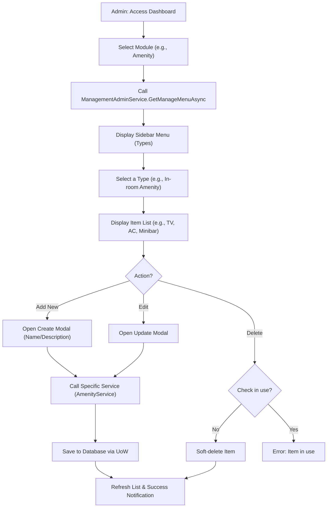

# Admin Management - Design Document

## 1. Process Flow: Manage Master Data



---

## 2. Wireframe (UI/UX Draft)

### 2.1. Admin Management Dashboard
```text
+---------------------------------------------------------------------------------------+
|  [ ADMIN PORTAL ]                              [ Notification ] [ Admin Profile ]     |
+-----------------+---------------------------------------------------------------------+
| SIDEBAR         |  MODULE: AMENITIES                                                  |
|                 +---------------------------------------------------------------------+
| [D] Dashboard   |  [ + ADD NEW TYPE ]                                                 |
|                 |                                                                     |
| MODULES:        |  TYPES:                                                             |
| > Amenities     |  1. In-room Amenities  [Edit] [Delete]                              |
| > Services      |  2. Bathroom          [Edit] [Delete]                              |
| > Policies      |  3. Food & Drink      [Edit] [Delete]                              |
| > Room Quality  |                                                                     |
|                 |  ITEMS IN "In-room Amenities":                                      |
| USERS           |  +------------------+-----------------------+--------------------+  |
| > Owners        |  | Name             | Description           | Actions            |  |
| > Customers     |  +------------------+-----------------------+--------------------+  |
|                 |  | Smart TV         | 4K Resolution...      | [Edit] [Delete]    |  |
| SETTINGS        |  | Air Conditioner  | Inverter tech...      | [Edit] [Delete]    |  |
|                 |  +------------------+-----------------------+--------------------+  |
+-----------------+---------------------------------------------------------------------+
```

---

## 3. Component Architecture
- **ManagementAdminService:** Provides the "Skeleton" for the menu.
- **Specific Services (AmenityService, PolicyService, etc.):** Handle detailed CRUD for each entity.
- **Dynamic UI (Blazor):** Uses shared components to display lists and input forms based on the selected module.
