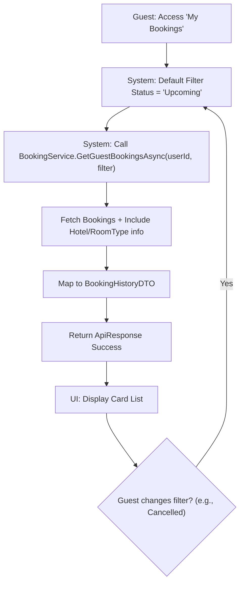
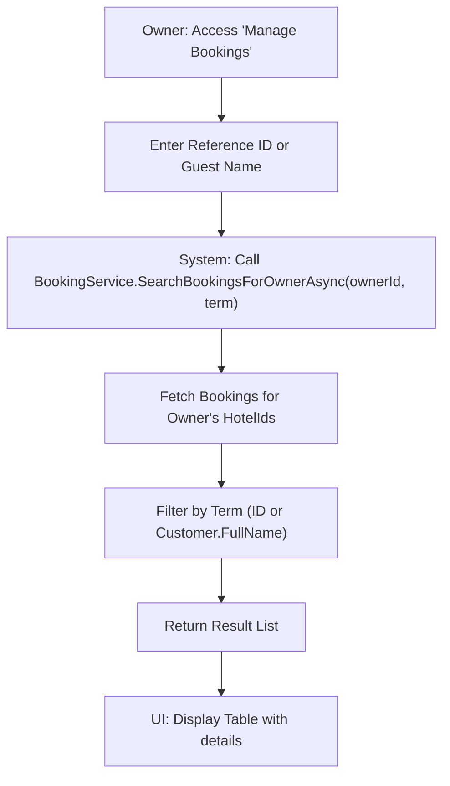

# Booking History - Design Document

## 1. Process Flow: Guest History Filtering



## 2. Process Flow: Owner Booking Search



---

## 3. Wireframe (UI/UX Draft)

### 3.1. Guest Booking History (Mobile Friendly)
```text
+-------------------------------------------------------+
|  MY BOOKINGS                                          |
+-------------------------------------------------------+
|  [ UPCOMING ]  [ COMPLETED ]  [ CANCELLED ]  [ ALL ]  |
+-------------------------------------------------------+
|  DAEWOO HANOI HOTEL                                   |
|  14/06/2026 - 16/06/2026 (2 nights)                   |
|  Status: [ CONFIRMED ]             Total: 3.300.000 đ |
|                                   [ VIEW DETAIL ]     |
+-------------------------------------------------------+
|  INTERCONTINENTAL WESTLAKE                            |
|  01/01/2026 - 03/01/2026                              |
|  Status: [ COMPLETED ]             Total: 5.000.000 đ |
|  [ REVIEW NOW ]                   [ VIEW DETAIL ]     |
+-------------------------------------------------------+
```

### 3.2. Owner Booking Management (Desktop View)
```text
+---------------------------------------------------------------------------------------+
|  BOOKING MANAGEMENT                                                                   |
+---------------------------------------------------------------------------------------+
|  Search: [ BK-123...      ]  Hotel: [ All Hotels v ]  Status: [ All Status v ]        |
+----------+------------------+-------------------+------------+-------------+----------+
| ID       | Customer         | Room Type         | Dates      | Total       | Status   |
+----------+------------------+-------------------+------------+-------------+----------+
| #BK-101  | John Doe         | Deluxe City View  | 14-16 Jun  | 3.3M        | [Pend]   |
| #BK-102  | Jane Smith       | Executive Suite   | 15-20 Jun  | 10.5M       | [Conf]   |
+----------+------------------+-------------------+------------+-------------+----------+
|                                                           [ Page 1 of 10 ]            |
+---------------------------------------------------------------------------------------+
```

---

## 4. Technical Implementation Notes
- **Include Logic:** Use `.Include(b => b.Hotel).ThenInclude(h => h.HotelImages)` to fetch hotel thumbnails for guest history.
- **Security:** Owners can only see bookings for their properties; Guests can only see their own bookings.
- **DTO Reuse:** `BookingHistoryDTO` can be shared between views but filtered at the service layer based on roles.
