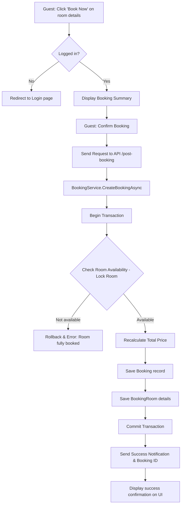

# US03: Book a Room - Design Document

## 1. Process Flow



---

## 2. Wireframe (UI/UX Draft)

### 2.1. Booking Summary Page
```text
+---------------------------------------------------------------------------------------+
|  CONFIRM YOUR BOOKING                                                                 |
+---------------------------------------+-----------------------------------------------+
|  STAY DETAILS                         |  PRICE SUMMARY                                |
|  Hotel: Daewoo Hanoi                  |  Room: 1,500,000 VNĐ x 2 nights               |
|  Room: Superior Double Room           |  Tax (10%):  300,000 VNĐ                      |
|  Dates: 14/06 - 16/06 (2 nights)      |  -------------------------------------------  |
|  Guests: 2 Adults                     |  TOTAL PRICE: 3,300,000 VNĐ                   |
+---------------------------------------+-----------------------------------------------+
|  [ ] I agree to the hotel policies and terms.                                         |
|                                                                                       |
|  [ BACK ]                                                         [ CONFIRM ]         |
+---------------------------------------------------------------------------------------+
```

### 2.3. Success Page
```text
+---------------------------------------------------------------------------------------+
|       [ ICON SUCCESS ]                                                                |
|       THANK YOU FOR YOUR BOOKING!                                                     |
|       Your Reference ID is: #BK-123456                                                |
|       Details have been sent to your email: guest@example.com                         |
|                                                                                       |
|       [ VIEW BOOKING HISTORY ]                            [ BACK TO HOME ]            |
+---------------------------------------------------------------------------------------+
```
