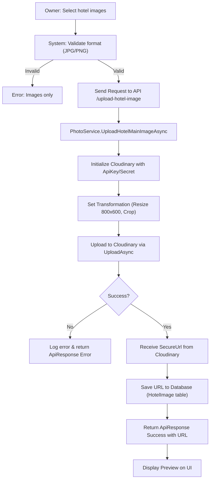

# Media Management - Design Document

## 1. Process Flow: Upload Hotel Image (Cloudinary)



---

## 2. Wireframe (UI/UX Draft)

### 2.1. Hotel Image Gallery (Owner Portal)
```text
+---------------------------------------------------------------------------------------+
|  [ OWNER PORTAL ]                                      [ Notification ] [ Profile ]   |
+-----------------+---------------------------------------------------------------------+
| SIDEBAR         |  MEDIA MANAGEMENT: HOTEL DAEWOO                                     |
|                 +---------------------------------------------------------------------+
| [D] Dashboard   |  COVER IMAGE:                                                       |
| [H] My Hotels   |  +-----------------------+                                          |
| [R] Room Types  |  |      [ PREVIEW ]      |  [ CHANGE COVER ] [ DELETE ]             |
| [B] Bookings    |  +-----------------------+                                          |
|                 |                                                                     |
| [M] Media       |  GALLERY IMAGES:                                                    |
|                 |  +-------+ +-------+ +-------+ [ + ADD IMAGE ]                      |
| [S] Settings    |  | IMG 1 | | IMG 2 | | IMG 3 |                                      |
|                 |  | [Del] | | [Del] | | [Del] |                                      |
|                 |  +-------+ +-------+ +-------+                                      |
+-----------------+---------------------------------------------------------------------+
```

### 2.2. Document Upload Section (Upgrade Request)
```text
+---------------------------------------------------------------------------------------+
|  UPLOAD BUSINESS LICENSE                                                              |
+---------------------------------------------------------------------------------------+
|  Selected File: [ business_license.pdf ]                                              |
|  Allowed formats: PDF, JPG, PNG (Max 5MB)                                             |
|                                                                                       |
|  [ PROGRESS BAR: 100% ]                                                               |
|                                                                                       |
|  [ REMOVE ]                                                       [ UPLOAD ]          |
+---------------------------------------------------------------------------------------+
```

---

## 3. Technical Implementation Details
- **Storage Provider:** Cloudinary (SaaS) is used for image storage and optimization.
- **Transformation:** Auto-apply `Width(800).Height(600).Crop("fill")` to ensure consistent UI display.
- **Organization:** Use Cloudinary folder structure: `HotelBooking/Hotels/user_{userId}/hotel_{hotelId}/{type}`.
- **Security:** Use `SecureUrl` (HTTPS) for all delivered assets.
- **Atomic Persistence:** Cloudinary upload and DB persistence should be coordinated to avoid "orphan" assets.
