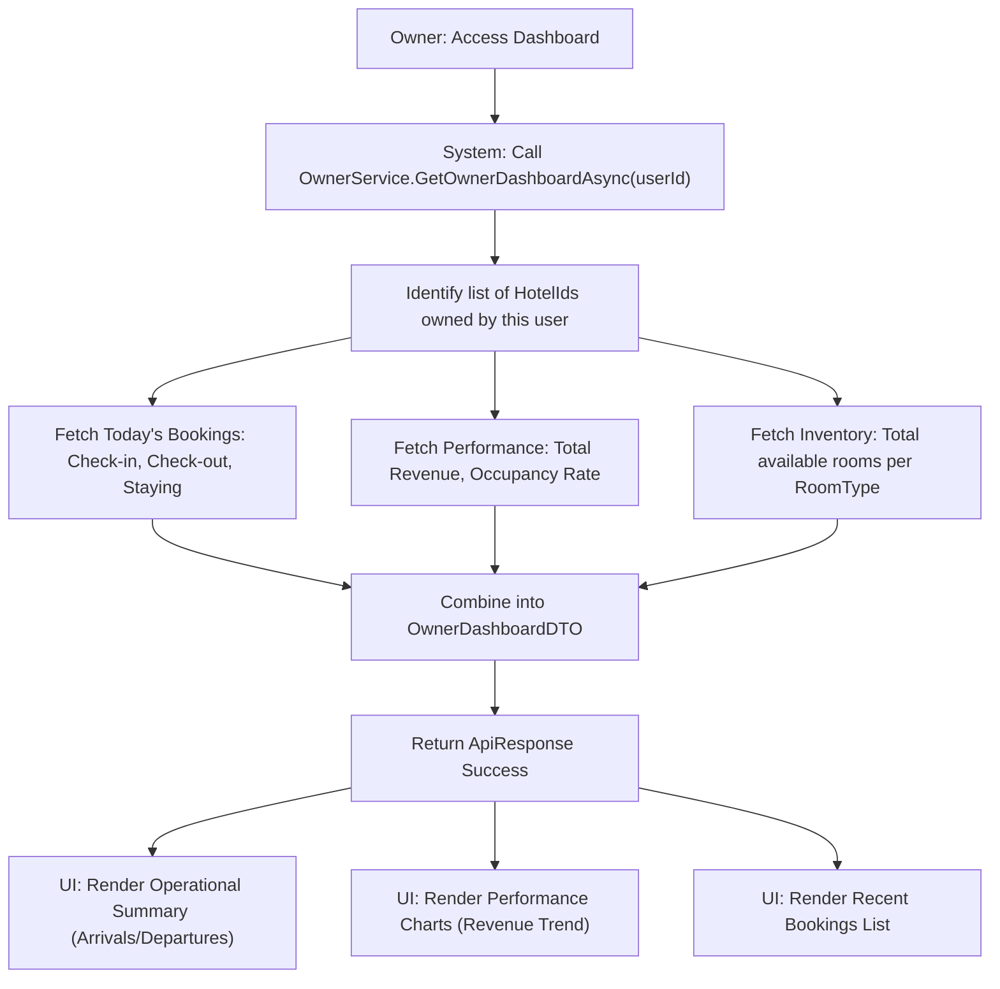

# Hotel Owner Dashboard - Design Document

## 1. Process Flow: Owner Data Aggregation



---

## 2. Wireframe (UI/UX Draft)

### 2.1. Owner Dashboard Overview
```text
+---------------------------------------------------------------------------------------+
|  [ OWNER PORTAL ]                                      [ Notification ] [ Profile ]   |
+-----------------+---------------------------------------------------------------------+
| SIDEBAR         |  DASHBOARD: DAEWOO HANOI HOTEL                       [ REFRESH ]    |
|                 +---------------------------------------------------------------------+
| [D] Dashboard   |  TODAY'S OVERVIEW                                                   |
| [H] My Hotels   |  +------------+  +------------+  +------------+  +------------+     |
| [R] Room Types  |  | ARRIVALS   |  | DEPARTURES |  | STAY-OVERS |  | REVENUE    |     |
| [B] Bookings    |  | 12 Guests  |  | 8 Guests   |  | 45 Guests  |  | 15.0M VNĐ  |     |
| [M] Media       |  +------------+  +------------+  +------------+  +------------+     |
|                 |                                                                     |
| [S] Settings    |  REVENUE TREND (LAST 30 DAYS)          ROOM AVAILABILITY            |
|                 |  +---------------------------+       +---------------------------+  |
| [L] Logout      |  |          [ CHART ]        |       | - Deluxe: 5 left          |
|                 |  |      (Revenue/Date)       |       | - Suite:  2 left          |
|                 |  +---------------------------+       | - Standard: FULL          |
|                 |                                      +---------------------------+  |
|                 |  RECENT BOOKINGS                     NOTIFICATIONS                  |
|                 |  +---------------------------+       +---------------------------+  |
|                 |  | #BK-101 - John Doe - Suite |       | [!] New Booking: #BK-105  |
|                 |  | #BK-102 - Lan Nguyen - Del |       | [i] Rating: 5* - "Great"  |
|                 |  +---------------------------+       +---------------------------+  |
+-----------------+---------------------------------------------------------------------+
```

---

## 3. Data Schema (OwnerDashboardDTO)
| Field | Type | Description |
|---|---|---|
| TodayArrivals | int | Bookings with CheckIn = Today |
| TodayDepartures | int | Bookings with CheckOut = Today |
| TotalStaying | int | Active bookings currently in-house |
| TotalRevenue | decimal | Sum of payments for owner's hotels |
| OccupancyRate | double | (Booked rooms / Total rooms) * 100 |
| RecentBookings | List<BookingDTO> | Latest 5 bookings |
| MonthlyRevenue | List<TrendDTO> | Day-by-day revenue for the current month |

---

## 4. Technical Implementation Notes
- **Owner Scope:** All queries must be filtered by `OwnerId` (from JWT) for data security.
- **Complexity:** Calculating `OccupancyRate` requires joining `RoomType`, `Room`, and `Booking`. Optimize queries to avoid UI lag.
- **Date Handling:** Use `DateTime.Today` in the property's local timezone for accurate Arrivals/Departures.
