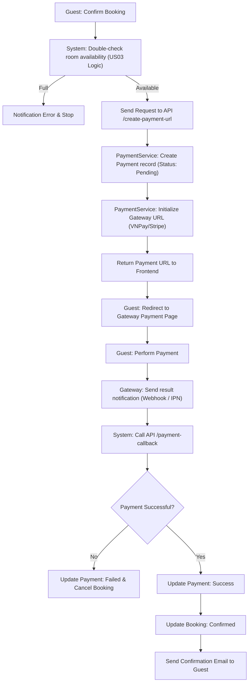

# Payment Management - Design Document

## 1. Process Flow: Checkout & Online Payment



---

## 2. Wireframe (UI/UX Draft)

### 2.1. Payment Method Selection (Part of Checkout)
```text
+-------------------------------------------------------+
|  CHOOSE PAYMENT METHOD                                |
+-------------------------------------------------------+
|  ( ) Pay at Hotel                                     |
|                                                       |
|  (x) Online Transfer (VNPay / Local Banks)            |
|      [ Logo VNPay ] [ Logo Banks... ]                 |
|                                                       |
|  ( ) International Card (Visa, Mastercard via Stripe) |
|      [ Logo Visa ] [ Logo Master ]                    |
+-------------------------------------------------------+
|                                  [ PAY NOW ]          |
+-------------------------------------------------------+
```

### 2.2. Transaction History (User Profile)
```text
+---------------------------------------------------------------------------------------+
|  TRANSACTION HISTORY                                                                  |
+---------------------------------------------------------------------------------------+
|  Date        | Booking ID | Method      | Amount      | Status     | Action           |
+--------------+------------+-------------+-------------+------------+------------------+
|  14/06/2026  | #BK-101    | VNPay       | 3,300,000 đ | [Success]  | [View Receipt]   |
|  10/05/2026  | #BK-095    | Cash        | 1,500,000 đ | [Pending]  | [Cancel]         |
+--------------+------------+-------------+-------------+------------+------------------+
```

---

## 3. Technical Implementation Details
- **Security:** Use **Checksum/Signature** to verify data integrity from Gateway.
- **Idempotency:** Ensure each transaction is processed only once to avoid duplicate payments.
- **Logging:** Log all Gateway Request/Response data for reconciliation.
- **Strategy Pattern:** Use Strategy Pattern for easy addition of new payment gateways.
