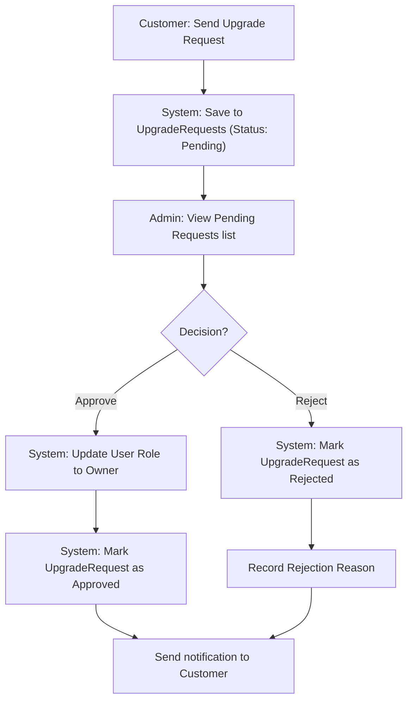
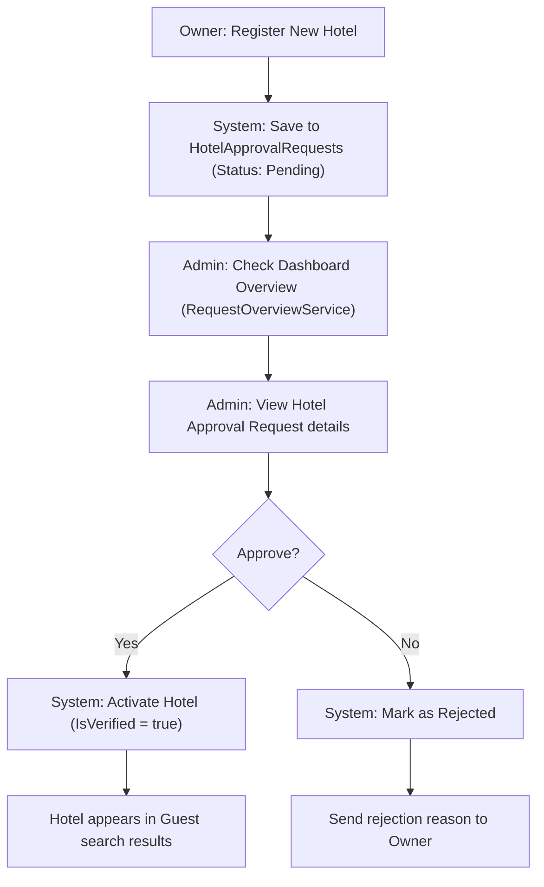

# Request Management - Design Document

## 1. Process Flow: Account Upgrade (Customer to Owner)



## 2. Process Flow: Hotel Approval (Owner)



---

## 3. Wireframe (UI/UX Draft)

### 3.1. Admin Request Overview (Dashboard)
```text
+---------------------------------------------------------------------------------------+
|  [ ADMIN ] REQUEST OVERVIEW                                                           |
+---------------------------------------------------------------------------------------+
|  OVERALL STATS                                                                        |
|  [ Total: 150 ] [ Pending: 12 ] [ Approved: 120 ] [ Rejected: 18 ]                    |
+---------------------------------------------------------------------------------------+
|  RECENT REQUESTS                                                                      |
|  +---------------------+-------------------+------------------+-----------+--------+  |
|  | Request Type        | Requester         | Date             | Status    | Action |  |
|  +---------------------+-------------------+------------------+-----------+--------+  |
|  | Upgrade Owner       | John Doe          | 14/06/2026       | [Pending] | [View] |  |
|  | Hotel Approval      | Hotel Daewoo      | 13/06/2026       | [Approved]| [View] |  |
|  | Upgrade Owner       | Jane Smith        | 12/06/2026       | [Rejected]| [View] |  |
|  +---------------------+-------------------+------------------+-----------+--------+  |
+---------------------------------------------------------------------------------------+
```

### 3.2. Approval Detail Modal/Page
```text
+---------------------------------------------------------------------------------------+
|  REQUEST DETAIL: UPGRADE OWNER                                                        |
+---------------------------------------------------------------------------------------+
|  USER INFO: John Doe (ID: 1024)                                                       |
|  REASON: "I have 3 boutique hotels in Hanoi and want to join the platform..."         |
|  DOCUMENTS: [ business_license.pdf ] [ identity_card.jpg ]                            |
+---------------------------------------------------------------------------------------+
|  REJECTION REASON (If rejecting):                                                     |
|  [_________________________________________________________________________________]  |
+---------------------------------------------------------------------------------------+
|                                                           [ REJECT ]      [ APPROVE ] |
+---------------------------------------------------------------------------------------+
```

---

## 4. Technical Implementation Notes
- **RequestOverviewService:** Uses repositories for real-time statistics calculation (Total, Today, etc.).
- **Role Switching:** Upgrades must switch roles in the `UserRole` table atomically.
- **Concurrency:** Ensure a user cannot submit multiple upgrade requests while one is pending.
