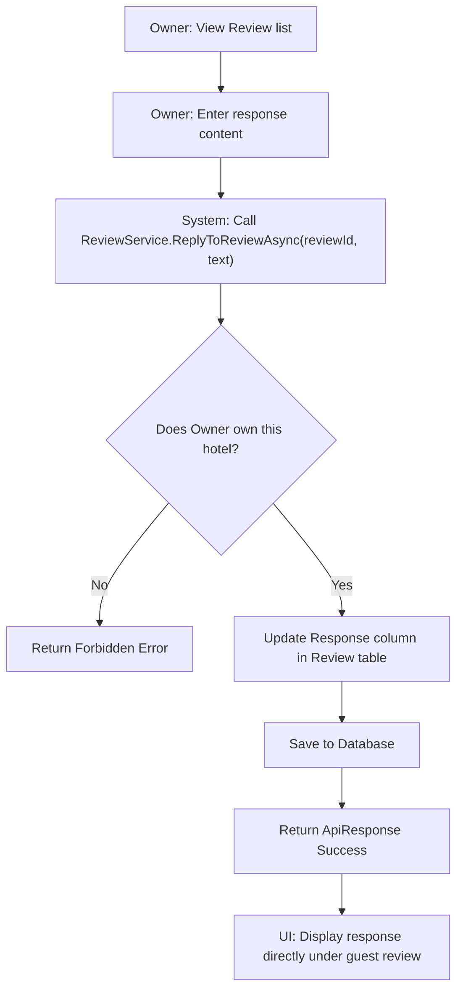
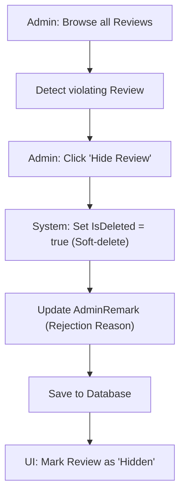

# Review Management (Extended) - Design Document

## 1. Process Flow: Owner Response



## 2. Process Flow: Admin Moderation



---

## 3. Wireframe (UI/UX Draft)

### 3.1. Owner Reply UI (Inside Management Portal)
```text
+---------------------------------------------------------------------------------------+
|  GUEST REVIEW                                                                         |
|  "The room was noisy but the staff was great." - Mr. John (7/10)                      |
+---------------------------------------------------------------------------------------+
|  YOUR RESPONSE:                                                                       |
|  [ Dear Mr. John, thank you for your honest feedback. We are working on...        ]  |
|                                                                                       |
|  [ CANCEL ]                                                       [ POST REPLY ]      |
+---------------------------------------------------------------------------------------+
```

### 3.2. Public Display (Hotel Details Page)
```text
+---------------------------------------------------------------------------------------+
|  [ * * * * ] 8/10 - John Doe (14/06/2026)                                             |
|  "Great room quality for the price."                                                  |
|                                                                                       |
|  |_ [ OWNER RESPONSE ] (15/06/2026)                                                   |
|     "Thanks John for your support, hope to see you again soon!"                      |
+---------------------------------------------------------------------------------------+
```

---

## 4. Technical Implementation Notes
- **Schema Update:** Added `OwnerResponseText` and `OwnerResponseAt` fields (via JSON `Additional` column).
- **Security Check:** Strictly verify that the replier's `userId` matches the `OwnerId` of the hotel.
- **Consistency:** When a review is hidden, `AvgRating` should be recalculated (only including `IsDeleted == false`).
