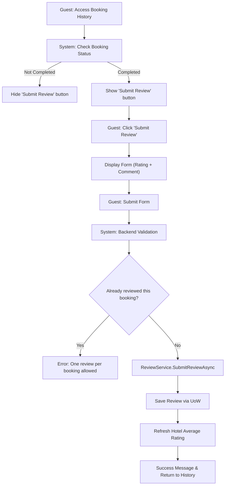
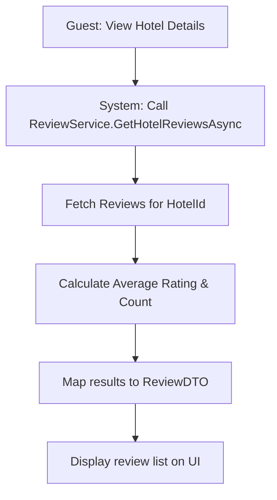

# Review Management - Design Document

## 1. Process Flow: Submit a Review



## 2. Process Flow: View Reviews (Hotel Details)



---

## 3. Wireframe (UI/UX Draft)

### 3.1. Submit Review Form (Modal)
```text
+-------------------------------------------------------+
|                SUBMIT YOUR REVIEW                     |
+-------------------------------------------------------+
|  Hotel: Hotel Daewoo Hanoi                            |
|  Stay Dates: 14/06 - 16/06/2026                       |
|                                                       |
|  Your Rating: [ * * * * * ] (5/5)                     |
|                                                       |
|  Comment:                                             |
|  [_________________________________________________]  |
|  [_________________________________________________]  |
|                                                       |
|  [ CANCEL ]                               [ SUBMIT ]  |
+-------------------------------------------------------+
```

### 3.2. Reviews List (In Hotel Details Page)
```text
+---------------------------------------------------------------------------------------+
|  CUSTOMER REVIEWS (8.5/10 - 120 Reviews)                                              |
+---------------------------------------------------------------------------------------+
|  John Doe      [ * * * * * ] (10/10)                                                  |
|  "Very clean room, friendly staff. Will come back!"                                   |
|  Posted: 14/06/2026                                                                   |
|  -----------------------------------------------------------------------------------  |
|  Jane Smith    [ * * * * ] (8/10)                                                     |
|  "Nice view, central location. Breakfast could be better."                            |
|  Posted: 12/06/2026                                                                   |
+---------------------------------------------------------------------------------------+
```

---

## 4. Technical Implementation Notes
- **Data Integrity:** Only allow reviews when Booking status is `Completed`.
- **Performance:** Use **Pagination** for hotels with thousands of reviews.
- **Security:** Sanitize comments to prevent XSS attacks.
- **Rating Calculation:** Average ratings are calculated dynamically for real-time accuracy.
