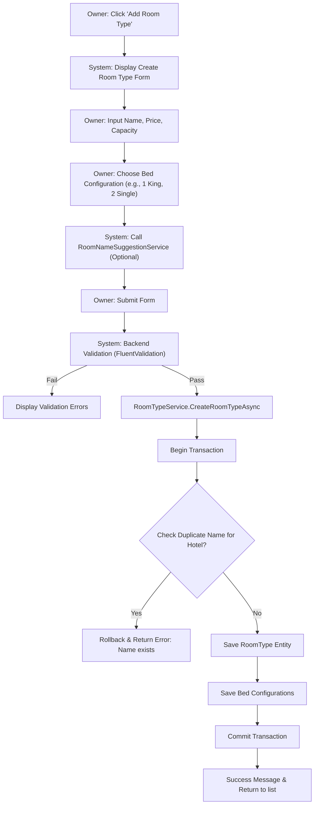
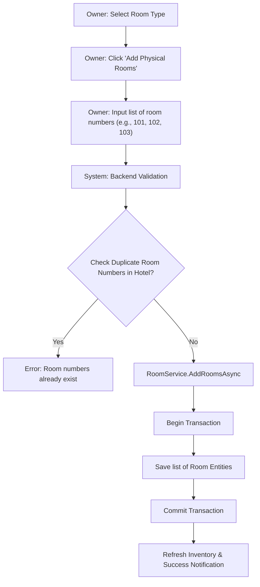

# Room Management - Design Document

## 1. Process Flow: Create Room Type



## 2. Process Flow: Manage Room Inventory (Batch Add)



---

## 3. Wireframe (UI/UX Draft)

### 3.1. Room Types Listing (Owner Portal)
```text
+---------------------------------------------------------------------------------------+
|  [ OWNER PORTAL ]                                      [ Notification ] [ Profile ]   |
+-----------------+---------------------------------------------------------------------+
| SIDEBAR         |  MY HOTEL: DAEWOO HANOI                                             |
|                 +---------------------------------------------------------------------+
| [D] Dashboard   |  [ + ADD NEW ROOM TYPE ]                                            |
| [H] My Hotels   |                                                                     |
| [R] Room Types  |  EXISTING ROOM TYPES:                                               |
| [B] Bookings    |  +----------------------+------------+-------------+-------------+  |
|                 |  | Room Type Name       | Price/Day  | Capacity    | Actions     |  |
| [S] Settings    |  +----------------------+------------+-------------+-------------+  |
|                 |  | Deluxe City View     | 1.500.000  | 2 Adults    | [Edit] [Del]|  |
|                 |  | Executive Suite      | 3.500.000  | 3 Adults    | [Edit] [Del]|  |
|                 |  +----------------------+------------+-------------+-------------+  |
+-----------------+---------------------------------------------------------------------+
```

### 3.2. Create Room Type Modal
```text
+---------------------------------------------------------------------------------------+
|  CREATE NEW ROOM TYPE                                                                 |
+---------------------------------------------------------------------------------------+
|  Room Name: [ Sea View Deluxe         ]  [ SUGGEST NAMES ]                            |
|  Description: [ Luxury room with balcony...                                       ]  |
|  Price/Night: [ 2.000.000 ]   Currency: [ VNĐ ]                                       |
+---------------------------------------+-----------------------------------------------+
|  BED CONFIGURATION                    |  CAPACITY                                     |
|  [+] 1 x King Bed                     |  Adults: [ 2 ]                                |
|  [-] 2 x Single Beds                  |  Children: [ 1 ]                              |
+---------------------------------------+-----------------------------------------------+
|  AMENITIES                            |  IMAGES                                       |
|  [x] WiFi  [x] AC  [ ] Mini Bar       |  [ UPLOAD IMAGES... ]                         |
+---------------------------------------+-----------------------------------------------+
|                                                           [ CANCEL ]      [ SAVE ]    |
+---------------------------------------------------------------------------------------+
```

### 3.3. Manage Room Inventory (Modal)
```text
+---------------------------------------------------------------------------------------+
|  MANAGE ROOMS: Deluxe City View                                                       |
+---------------------------------------------------------------------------------------+
|  CURRENT ROOMS: [ 101 ] [ 102 ] [ 103 ] [ 104 (Maintenance) ]                         |
|                                                                                       |
|  [ + BATCH ADD ROOMS ]                                                                |
|  Enter Room Numbers (separated by comma):                                             |
|  [ 201, 202, 203, 204, 205                                                        ]  |
|                                                                                       |
|  [ ] Auto-assign 'Active' status to new rooms.                                        |
+---------------------------------------------------------------------------------------+
|                                                           [ CANCEL ]      [ ADD ]     |
+---------------------------------------------------------------------------------------+
```

---

## 4. Technical Implementation Details
- **Atomicity:** `RoomType` and `RoomTypeBedConfig` must be saved in the same transaction.
- **Data Normalization:** Room names are trimmed and case-normalized before uniqueness checks.
- **Ghost ID Validation:** Use `RoomAttributeFacade` to verify foreign keys (UnitType, BedType, etc.) before business logic.
- **Additional Data:** Metadata (total rooms, smoking status) stored as JSON in `Additional` column for flexibility.
