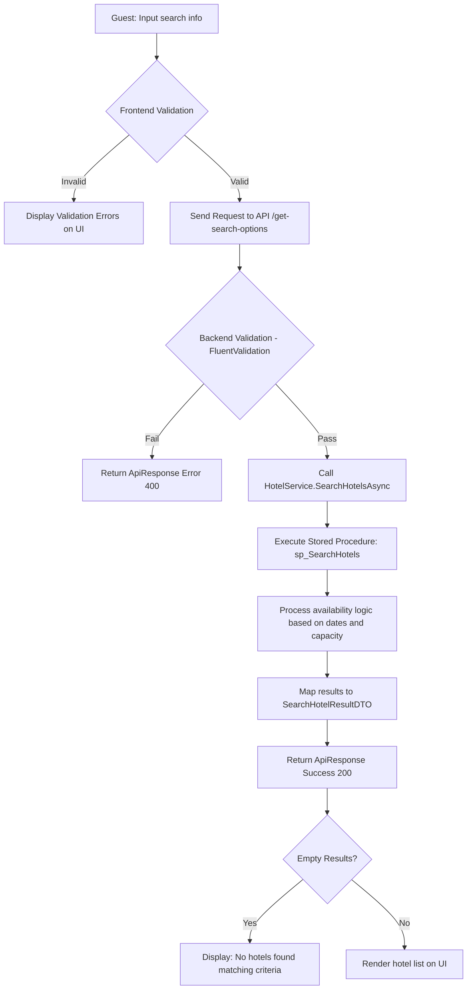

# US01: Search for Hotels - Design Document

## 1. Process Flow (Activity Diagram)



---

## 2. Wireframe (UI/UX Draft)

### 2.1. Search Bar Component (Top/Hero Section)
```text
+---------------------------------------------------------------------------------------+
|  Location: [ Enter city... ] | Dates: [ 14/06 - 16/06 ] | Guests: [ 2 adults, 1 room ]| [ SEARCH ] |
+---------------------------------------------------------------------------------------+
```

### 2.2. Search Results Page
```text
+---------------------------------------------------------------------------------------+
|  [ FILTERS: Price, Stars, Amenities ]  |  SORT BY: [ Lowest Price | Highest Rating ]  |
+---------------------------------------+-----------------------------------------------+
|                                       |  1. Daewoo Hanoi Hotel                        |
|       [ THUMBNAIL IMAGE ]             |  [****] 8.5 (120 reviews)                     |
|                                       |  Address: 360 Kim Ma, Ba Dinh, Hanoi          |
|                                       |  -------------------------------------------  |
|                                       |  From: 1,500,000 VNĐ / night                  |
|                                       |  [ 3 ROOMS LEFT ]          [ VIEW DETAILS ]   |
+---------------------------------------+-----------------------------------------------+
|                                       |  2. InterContinental Hanoi Westlake           |
|       [ THUMBNAIL IMAGE ]             |  [*****] 9.2 (450 reviews)                    |
|                                       |  Address: 05 Tu Hoa, Tay Ho, Hanoi            |
|                                       |  -------------------------------------------  |
|                                       |  From: 3,200,000 VNĐ / night                  |
|                                       |  [ 5 ROOMS LEFT ]          [ VIEW DETAILS ]   |
+---------------------------------------+-----------------------------------------------+
```

---

## 3. Data Requirements (Mapping)
| UI Element | DTO Property | Source (DB) |
|---|---|---|
| Hotel Name | Name | Hotel.Name |
| Rating | AvgRating | Review (Average) |
| Reviews | ReviewCount | Review (Count) |
| Price | PriceFrom | RoomType (Min Price) |
| Availability | AvailableRooms | Room (Filtered by Booking) |
| Thumbnail | CoverImageUrl | Hotel.CoverImageUrl |
