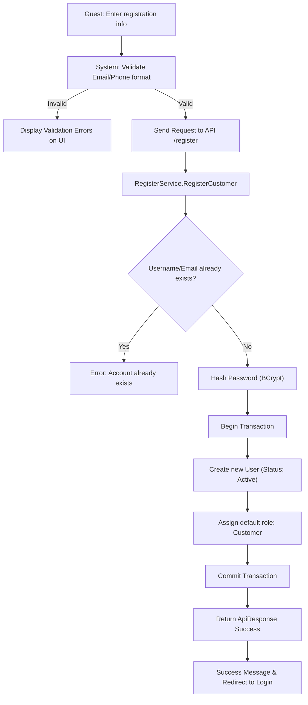
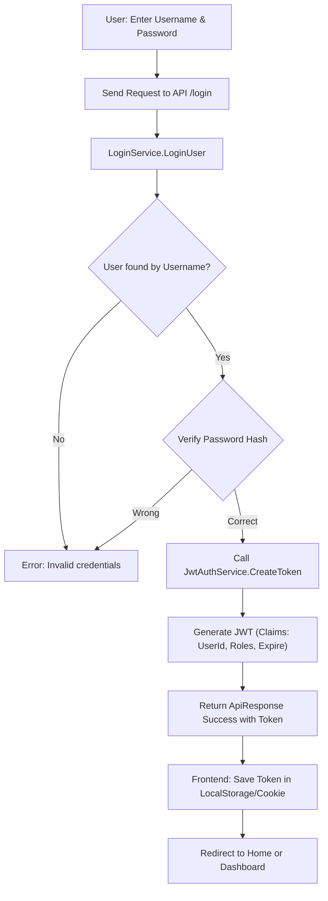

# User Management - Design Document

## 1. Process Flow: User Registration



## 2. Process Flow: User Login (JWT)



---

## 2. Wireframe (UI/UX Draft)

### 3.1. Login Page
```text
+-------------------------------------------------------+
|                    [ LOG IN ]                         |
+-------------------------------------------------------+
|  Username/Email:                                      |
|  [_________________________________________________]  |
|                                                       |
|  Password:                                            |
|  [_________________________________________________]  |
|                                                       |
|  [ ] Remember me                  [ Forgot Password? ]|
|                                                       |
|                     [ LOGIN ]                         |
|                                                       |
|  Don't have an account? [ REGISTER ]                  |
+-------------------------------------------------------+
```

### 3.2. User Profile Page
```text
+---------------------------------------------------------------------------------------+
|  MY PROFILE                                                                           |
+-----------------+---------------------------------------------------------------------+
| [D] Dashboard   |  PERSONAL INFORMATION                                               |
| [B] Bookings    |  +-----------------------+                                          |
| [P] Profile     |  |      [ AVATAR ]       |  Full Name: [ John Doe            ]     |
| [L] Logout      |  +-----------------------+  Email:     [ guest@example.com    ]     |
|                 |                             Phone:     [ 0901234567           ]     |
|                 |  [ CHANGE AVATAR ]          Birthday:  [ 01/01/1995           ]     |
|                 |                                                                     |
|                 |  [ CHANGE PASSWORD ]                            [ SAVE CHANGES ]    |
+-----------------+---------------------------------------------------------------------+
```

---

## 3. Technical Implementation Details
- **Authentication:** Token-based (JWT). Token sent in `Authorization: Bearer <token>` header.
- **Password Security:** Never store clear text passwords. Use secure hashing libraries.
- **Role-Based Access Control (RBAC):** Admin, Owner, and Customer roles restrict endpoint access via `[Authorize(Roles = "...")]`.
- **Identity Facade:** `UserService` acts as a Facade to hide registration/login complexity.
