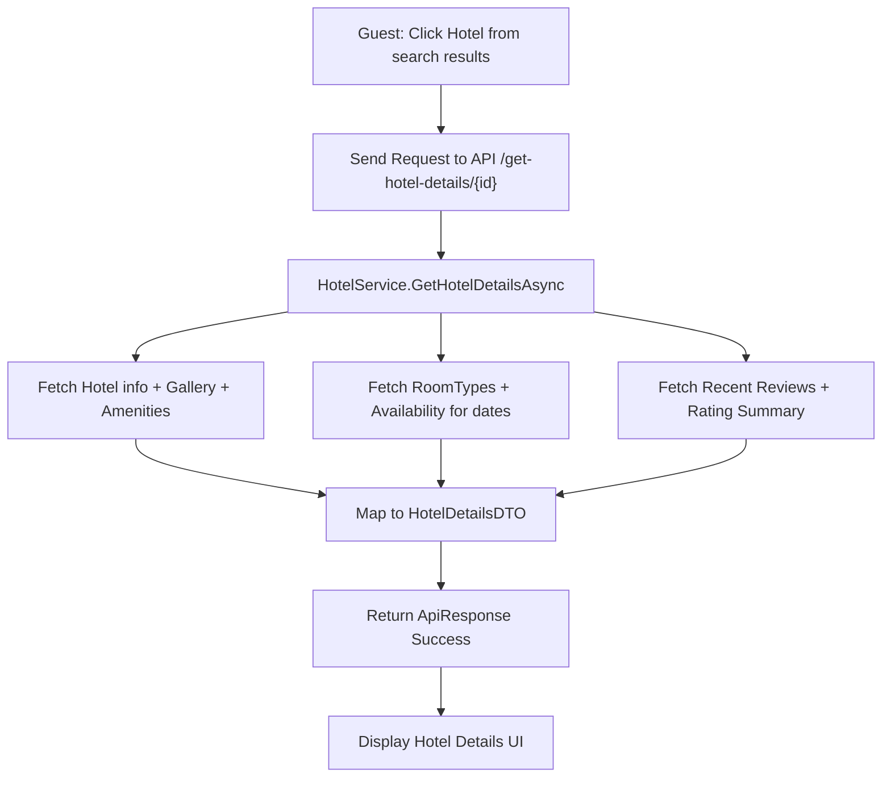

# US02: View Hotel Details - Design Document

## 1. Process Flow



---

## 2. Wireframe (UI/UX Draft)

### 2.1. Hotel Header & Gallery
```text
+---------------------------------------------------------------------------------------+
|  Hotel Name: Daewoo Hanoi [*****]  (8.5/10 - 120 reviews)                             |
|  Address: 360 Kim Ma, Ba Dinh, Hanoi                                                 |
+---------------------------------------+-----------------------------------------------+
|                                       |       [ Thumbnail 1 ] [ Thumbnail 2 ]         |
|           [ LARGE IMAGE ]             |                                               |
|                                       |       [ Thumbnail 3 ] [ Thumbnail 4 ]         |
+---------------------------------------+-----------------------------------------------+
```

### 2.2. Description & Amenities
```text
+-------------------------------------------------------+-------------------------------+
|  DESCRIPTION                                          |  AMENITIES                    |
|  "Daewoo Hanoi is a luxury hotel located in..."       |  [x] Free WiFi  [x] Pool      |
|                                                       |  [x] Spa        [x] Gym       |
+-------------------------------------------------------+-------------------------------+
```

### 2.3. Available Room Types
```text
+---------------------------------------------------------------------------------------+
|  ROOM TYPE               |  CAPACITY   |  PRICE/NIGHT  |  ACTION                      |
+--------------------------+-------------+---------------+------------------------------+
|  Superior Double Room    |  2 Adults   |  1,500,000    |  [ CHOOSE ]                  |
|  - 25 sqm, City view     |             |               |                              |
+--------------------------+-------------+---------------+------------------------------+
|  Deluxe Suite            |  2 Adults   |  3,500,000    |  [ CHOOSE ]                  |
|  - 50 sqm, Lake view     |  1 Child    |               |                              |
+--------------------------+-------------+---------------+------------------------------+
```

### 2.4. Reviews Section
```text
+---------------------------------------------------------------------------------------+
|  REVIEWS (8.5/10)                                                                     |
|  - "Excellent service!" - Nguyễn Văn A (10/10)                                       |
|  - "The view was amazing." - Tran Thi B (9/10)                                       |
+---------------------------------------------------------------------------------------+
```
